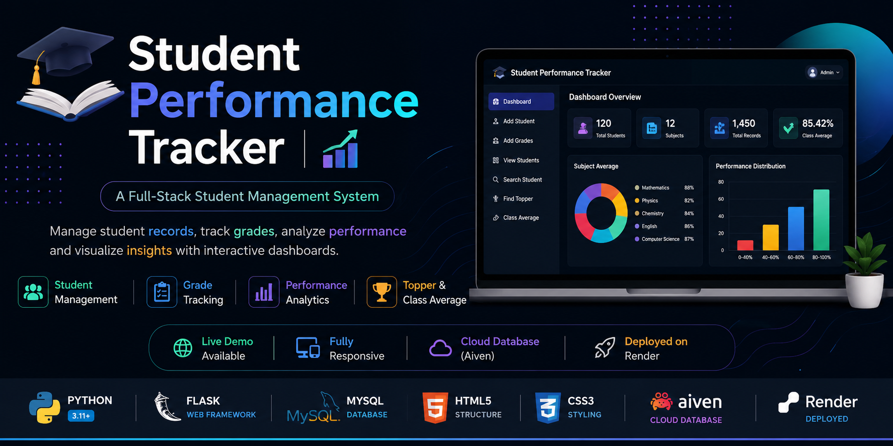
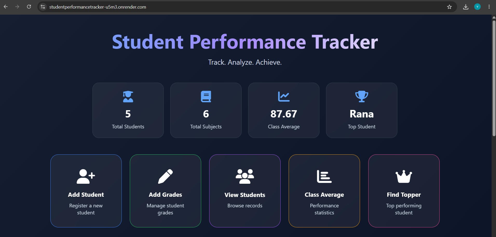
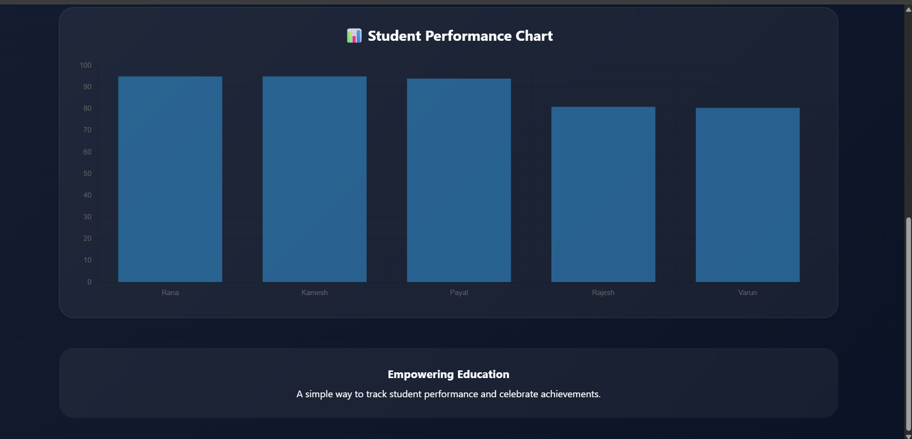
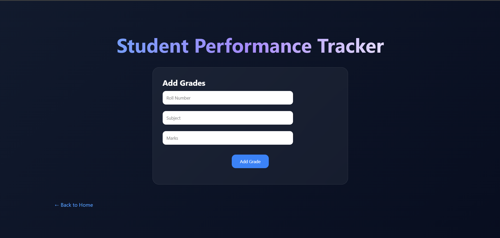
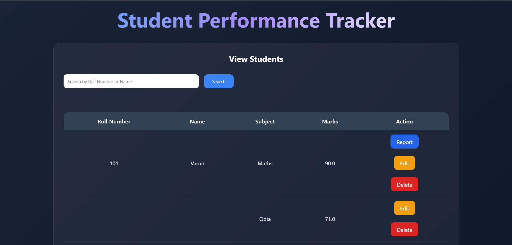
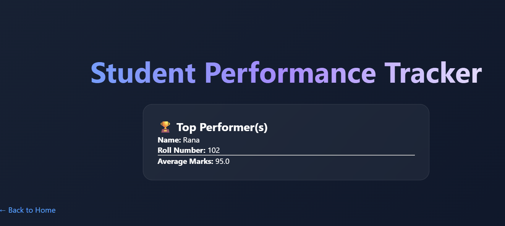
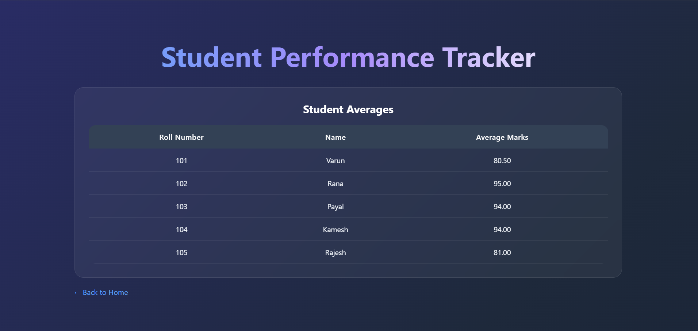

<p align="center">
  
</p>

# 🎓 Student Performance Tracker

<div align="center">

### 📚 A Full-Stack Student Management Web Application

**Developed using Flask, MySQL, HTML, CSS and Aiven Cloud Database**


</div>

---

## 🌐 Live Demo

🔗 **Live Application**

https://studentperformancetracker-u5m3.onrender.com/

---

## 📖 Project Overview

Student Performance Tracker is a full-stack web application developed to simplify student academic record management.

The application enables teachers or administrators to maintain student records, assign subject-wise marks, calculate averages, identify top-performing students, and manage academic data efficiently through a user-friendly web interface.

The project demonstrates backend development using Flask, relational database management with MySQL, cloud database integration using Aiven, and deployment on Render.

---

## 🚀 Technology Stack

|    Category     | Technology    |
|-----------------|---------------|
| Backend         | Python, Flask |
| Frontend        | HTML5, CSS3   |
| Database        | MySQL         |
| Cloud Database  | Aiven         |
| Deployment      | Render        |
| Version Control | Git & GitHub  |

---

## ✨ Key Features

- 👨‍🎓 Add New Students
- 📝 Assign Subject-wise Grades
- 🔍 Search Students by Roll Number or Name
- 📋 View Student Details
- ✏️ Edit Student Grades
- 🗑️ Delete Student Records
- 📊 Calculate Student Average
- 🏆 Find Topper (Supports Multiple Toppers with Same Average)
- 📈 Class Average Calculation
- ✅ Input Validation
- 🌐 Responsive Web Interface
- ☁️ Cloud Database Integration

---

# 📸 Project Screenshots

## 🏠 Home Dashboard

The dashboard provides quick navigation to all major modules of the application.



---

## 📈 Dashboard Analytics

Interactive charts provide a visual overview of student performance and academic statistics.



---

## 👨‍🎓 Add Student


---

## 📝 Add Grades



---

## 📋 View Students



---

## 🔍 Search Student


---

## 🏆 Find Topper



---

## 📊 Class Average



---

# 📂 Project Structure

```
StudentPerformanceTracker/
│
├── static/
├── templates/
├── documentation/
│   └── Student_Performance_Tracker_user_guide MySQL.pdf
├── screenshots/
├── app.py
├── db.py
├── create_tables.py
├── requirements.txt
├── Procfile
├── README.md
└── .gitignore
```

---

# ⚙️ Installation

1. Clone the repository

```bash
git clone https://github.com/baburao-analyst/StudentPerformanceTracker.git
```

2. Navigate to the project directory

```bash
cd StudentPerformanceTracker
```

3. Install the required packages

```bash
pip install -r requirements.txt
```

4. Configure your MySQL database (Aiven or local MySQL).

5. Create the required tables

```bash
python create_tables.py
```

6. Run the Flask application

```bash
python app.py
```

---

# 📖 Documentation

The complete User Guide is available in the **documentation** folder.

```
documentation/Student_Performance_Tracker_user_guide MySQL.pdf
```

---

# 👨‍💻 Author

**Pulakala Babu Rao**

GitHub:
https://github.com/baburao-analyst

---

## ⭐ Support

If you found this project helpful, consider giving this repository a ⭐ on GitHub.